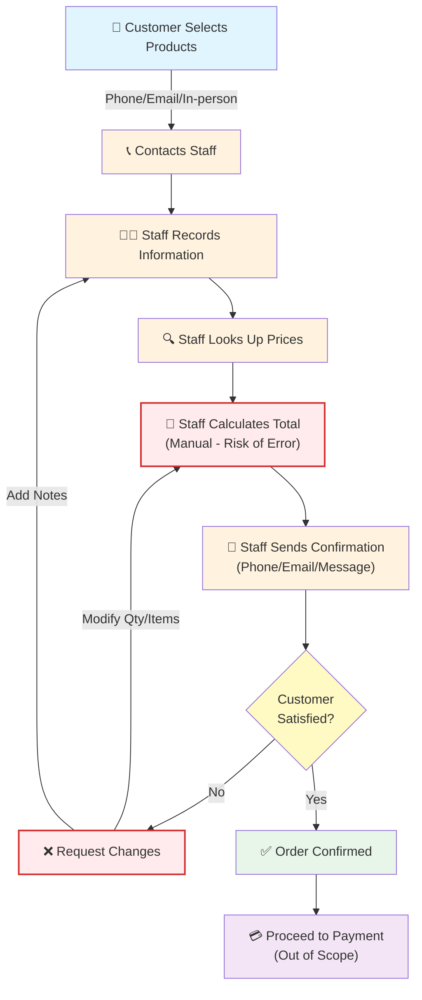
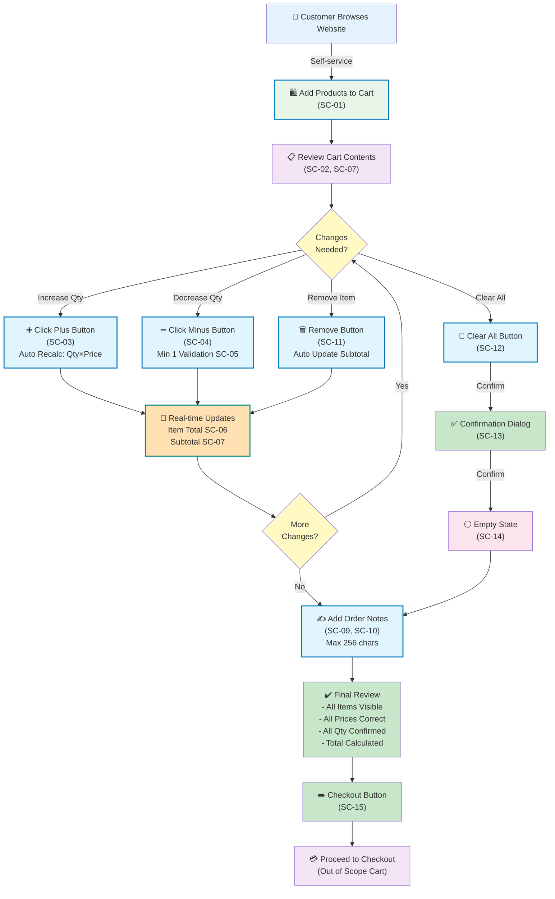

# AS-IS và TO-BE Process Analysis
## Module Giỏ Hàng - Đại Phú E-commerce

---

## 1. Mục Đích của AS-IS và TO-BE

Tài liệu này phân tích quy trình chuẩn bị đơn hàng trước bước thanh toán trong hai tình huống:

### AS-IS (Proposed Reconstruction)
**Mô tả:** Quy trình hiện tại được **dự kiến/phục dựng** dựa trên mô tả vấn đề kinh doanh trong documentation.

**Quan trọng:** AS-IS trong tài liệu này **KHÔNG phải** là quy trình được khách hàng (Đại Phú) xác nhận chính thức. Đây là bản phục dựng nhằm phục vụ mục đích phân tích portfolio, dựa trên các mô tả vấn đề kinh doanh và quy trình hiện tại.

**Mục đích:**
- Xác định các bước hiện tại trong quy trình
- Nhận diện các điểm yếu (pain points) trong quy trình
- Xác định root causes của các vấn đề
- Thiết lập baseline để so sánh với TO-BE

### TO-BE (Proposed Solution)
**Mô tả:** Quy trình mới được đề xuất sau khi triển khai module Giỏ hàng.

**Quan trọng:** TO-BE **CHỈ** mô tả quy trình mà module Giỏ hàng sẽ hỗ trợ. Đây là **Proposed Solution** dựa trên các yêu cầu đã được phân tích và thiết kế. TO-BE **KHÔNG** đã được triển khai lên production.

**Mục đích:**
- Mô tả quy trình cải thiện sử dụng Shopping Cart Module
- Loại bỏ hoặc giảm thiểu các pain points
- Tạo foundation cho implementation phase tiếp theo

---

## 2. Source and Validation Status

### AS-IS Source

| Nguồn | Loại Thông Tin | Status |
|------|-----------------|--------|
| **docs/02-business-context.md** | Business Problem, User Needs, Customer Journey | Primary Source |
| **docs/02-business-context.md (Section 5-6)** | Problem Statements | Reference |
| **docs/02-business-context.md (Section 4)** | Role of Shopping Cart in Customer Journey | Reference |
| **source-documents/source-material.md** | Project Limitations | Reference |
| **Portfolio Analysis** | Proposed Reconstruction | Secondary |

### Validation Status

| Mục | Status | Chi Tiết |
|-----|--------|---------|
| **AS-IS Documentation** | ⚠️ **Proposed, Not Confirmed** | AS-IS là bản phục dựng từ business problem descriptions; **chưa được Đại Phú xác nhận chính thức** |
| **Source Confirmations** | ✅ **Confirmed from docs** | Business problems & pain points được confirm trong docs/02 |
| **Assumptions** | ⚠️ **Assumed for Portfolio** | Many AS-IS details được giả định để phục vụ analysis |
| **TO-BE Basis** | ✅ **From Phase 1 Analysis** | TO-BE dựa trên 15 shopping cart functions đã analyzed & designed |
| **Implementation Status** | ❌ **Not Implemented** | TO-BE **chỉ là proposed solution**, chưa được triển khai |

---

## 3. Proposed AS-IS Reconstruction

### 3.1. Mô Tả Bối Cảnh AS-IS

**Tiêu đề:** Quy trình chuẩn bị đơn hàng trước thanh toán - Tình Huống Hiện Tại (Proposed)

**Lưu ý Quan Trọng:** 
Quy trình AS-IS dưới đây được **phục dựng từ mô tả các vấn đề kinh doanh** trong tài liệu, không phải từ validation trực tiếp với Đại Phú. Đây là **giả định phục vụ portfolio analysis**, cần được xác nhận bởi stakeholders.

**Các Channel Tương Tác (Assumed):**
- Khách hàng duyệt & lựa chọn sản phẩm (đã in danh sách, qua điện thoại, hoặc qua website)
- Yêu cầu thông qua điện thoại, email, hoặc trực tiếp
- Nhân viên xử lý, tính toán, ghi nhận

**Các Giả Định AS-IS:**
1. Quy trình chủ yếu thủ công hoặc bán thủ công
2. Khách hàng không có visibility toàn bộ đơn hàng
3. Tính toán giá có thể xảy ra sai sót
4. Thay đổi số lượng/ghi chú yêu cầu trao đổi thêm
5. Khách hàng khó kiểm tra/xác nhận trước thanh toán

---

## 4. AS-IS Process Steps

### 4.1. Quy Trình Chi Tiết (Proposed AS-IS)

```
Bước 1: CUSTOMER SELECTS PRODUCTS
├─ Khách hàng lựa chọn sản phẩm
│  ├─ Thông qua danh sách in, catalog
│  ├─ Hoặc qua website (nếu có browsing)
│  └─ Yêu cầu số lượng cho từng sản phẩm
│
├─ Liên hệ với nhân viên bán hàng
│  ├─ Qua điện thoại
│  ├─ Qua email
│  └─ Hoặc trực tiếp

Bước 2: STAFF RECEIVES & RECORDS
├─ Nhân viên tiếp nhận yêu cầu
├─ Ghi chép thông tin sản phẩm & số lượng
│  ├─ Bằng tay hoặc input system
│  └─ Có rủi ro sai sót
├─ Kiểm tra tồn kho (nếu có)
└─ Ghi chú đặc biệt từ khách hàng (nếu có)

Bước 3: STAFF CALCULATES PRICES
├─ Nhân viên tra cứu giá từng sản phẩm
├─ Tính toán: Qty × Unit Price = Item Total
│  ├─ Có thể xảy ra lỗi tính toán
│  └─ Nếu số lượng thay đổi → tính lại
├─ Tính toán subtotal
│  └─ Sum of Item Totals
└─ Có thể thêm phí (nếu có)

Bước 4: CUSTOMER REVIEWS (LIMITED)
├─ Khách hàng nghe/đọc thông tin từ nhân viên
│  ├─ Qua điện thoại (chỉ nghe)
│  ├─ Qua email (có thể xem tóm tắt)
│  └─ Không có visibility đầy đủ
├─ Khách hàng khó xác minh:
│  ├─ Tất cả sản phẩm
│  ├─ Số lượng chính xác
│  ├─ Giá chính xác
│  └─ Tổng tiền
└─ Sai sót có thể phát hiện muộn

Bước 5: ADJUSTMENTS (IF NEEDED)
├─ Nếu khách hàng muốn thay đổi:
│  ├─ Xóa sản phẩm
│  ├─ Thêm/giảm số lượng
│  └─ Thêm ghi chú
├─ Nhân viên phải:
│  ├─ Cập nhật ghi chép
│  ├─ Tính lại giá
│  └─ Ghi nhận lại
└─ Quá trình lặp lại → tốn thời gian

Bước 6: FINALIZATION
├─ Nhân viên tổng hợp order final
├─ Gửi xác nhận cho khách hàng
│  ├─ Qua điện thoại (nói lại)
│  ├─ Qua email (danh sách)
│  └─ Có rủi ro hiểu lầm
└─ Chuyển sang bước thanh toán/vận chuyển
```

### 4.2. Actors & Touchpoints (AS-IS Proposed)

| Phase | Actor | Action | Touchpoint |
|-------|-------|--------|-----------|
| **Selection** | Customer | Lựa chọn sản phẩm | Phone/Email/In-person |
| **Communication** | Customer | Gửi yêu cầu | Phone/Email |
| **Recording** | Staff | Ghi nhận thông tin | Internal System/Paper |
| **Verification** | Staff | Kiểm tra tồn kho | Backend System |
| **Calculation** | Staff | Tính giá | Spreadsheet/Calculator/Head |
| **Review** | Customer | Xem lại thông tin | Phone/Email |
| **Adjustment** | Customer/Staff | Thay đổi nếu cần | Phone/Email |
| **Confirmation** | Staff | Xác nhận final | Email/Phone |
| **Handover** | Staff | Chuyển thanh toán | Invoice/Order |

---

## 5. Identified Pain Points

### 5.1. Pain Points từ AS-IS (Proposed)

| ID | Pain Point | Severity | Mô Tả | Root Cause |
|----|-----------|----------|--------|-----------|
| **PP-01** | **Không có visibility toàn bộ đơn hàng** | 🔴 High | Khách hàng không thể xem toàn bộ sản phẩm, số lượng, giá tại một chỗ | Quy trình thủ công, không có tool unified |
| **PP-02** | **Rủi ro sai sót tính toán** | 🔴 High | Nhân viên tính toán thủ công → lỗi | Manual calculation, không có validation |
| **PP-03** | **Khó thay đổi số lượng** | 🟠 Medium-High | Mỗi thay đổi yêu cầu trao đổi & tính lại | Quy trình trao đổi thủ công |
| **PP-04** | **Ghi chú không rõ ràng** | 🟠 Medium | Ghi chú có thể lẫn lộn, mất, hoặc hiểu lầm | Communication channel không structured |
| **PP-05** | **Tồn thời gian tương tác** | 🟠 Medium | Nhiều vòng trao đổi → delay | Quy trình iterative, không có tool |
| **PP-06** | **Khó quản lý order changes** | 🟠 Medium | Khi khách hàng muốn thay đổi phức tạp | Không có clear process |
| **PP-07** | **Không có confirmation rõ ràng** | 🟡 Low-Medium | Xác nhận qua điện thoại có thể hiểu lầm | Confirmation method không robust |
| **PP-08** | **Không có audit trail** | 🟡 Low | Khó track lịch sử thay đổi order | Quy trình manual không có logging |
| **PP-09** | **Khó hỗ trợ scalability** | 🟡 Low | Khi số order tăng → quy trình không scale | Quy trình manual |

### 5.2. Source của Pain Points

| Pain Point | Từ Tài Liệu | Mức Độ Confirm |
|-----------|-----------|-----------------|
| PP-01 ~ PP-04 | docs/02, Section 5 (Business Problems) | ✅ Confirmed |
| PP-05 ~ PP-07 | docs/02, Section 4-6 (Vấn đề Thiếu Tool) | ✅ Confirmed |
| PP-08 ~ PP-09 | docs/02, Section 5 (Implied) | ⚠️ Inferred |

---

## 6. Root Cause Observations

### 6.1. Root Causes (AS-IS Proposed Analysis)

| Root Cause | Pain Points Liên Quan | Mô Tả |
|-----------|---------------------|--------|
| **Lack of Unified Tool** | PP-01, PP-05, PP-06 | Không có tool để customer & staff cùng xem order details |
| **Manual Processes** | PP-02, PP-03, PP-07 | Quy trình thủ công → lỗi, chậm, không consistent |
| **No Automation** | PP-02, PP-05 | Tính giá, validation không tự động |
| **Communication Gaps** | PP-04, PP-07, PP-08 | Multiple channels → lẫn lộn, mất thông tin |
| **No Real-time Updates** | PP-01, PP-05, PP-06 | Customer & staff không sync real-time |
| **Lack of Visibility** | PP-01, PP-04, PP-08 | Không có single source of truth cho order |

### 6.2. Business Impact (AS-IS Issues)

| Impact | Severity | Mô Tả |
|--------|----------|--------|
| **Customer Experience** | 🔴 High | Khách hàng khó tin tưởng, khó quản lý order |
| **Order Accuracy** | 🔴 High | Risk của lỗi → customer complaint, refund |
| **Operational Efficiency** | 🟠 Medium | Staff tốn thời gian xử lý, iterate |
| **Scalability** | 🟠 Medium | Quy trình không thể scale khi order tăng |
| **Support Burden** | 🟡 Low-Medium | Nhiều support request do miscommunication |

---

## 7. TO-BE Process

### 7.1. Mô Tả Bối Cảnh TO-BE

**Tiêu đề:** Quy trình chuẩn bị đơn hàng với Shopping Cart Module (Proposed TO-BE)

**Lưu ý Quan Trọng:**
- TO-BE mô tả quy trình **được hỗ trợ bởi Shopping Cart Module** đã được phân tích và thiết kế trong Phase 1
- TO-BE **CHƯA được triển khai** lên production; đây chỉ là **proposed solution**
- TO-BE dựa trên 15 shopping cart functions đã identified trong Phase 1
- TO-BE **KHÔNG bao gồm** thanh toán, vận chuyển, hoặc các module khác

**Giả Định TO-BE:**
1. Shopping Cart Module đã được phát triển (Phase 2+)
2. Backend API cung cấp product data & pricing
3. Khách hàng có access đến website với Shopping Cart UI
4. Staff có thể monitor/support nếu cần
5. Checkout module sẽ xử lý bước tiếp theo

---

## 8. TO-BE Process Steps

### 8.1. Quy Trình Chi Tiết (Proposed TO-BE)

```
Bước 1: CUSTOMER BROWSES & SELECTS PRODUCTS
├─ Khách hàng truy cập website
├─ Duyệt danh sách sản phẩm (trong Product Listing)
│  ├─ Xem hình ảnh, tên, giá, mô tả
│  └─ Lọc/tìm kiếm sản phẩm (nếu có)
├─ Chọn sản phẩm cần mua
└─ Thêm vào Shopping Cart (SC-01 trigger)

Bước 2: CUSTOMER REVIEWS CART CONTENTS
├─ Khách hàng xem danh sách sản phẩm trong Cart (SC-01)
│  ├─ View: [Product Image, Name, Unit Price, Quantity, Item Total]
│  └─ Layout: Table/Grid format trên UI
├─ System display: Subtotal (SC-07)
│  └─ Sum của tất cả Item Totals
└─ Khách hàng có FULL VISIBILITY

Bước 3: CUSTOMER MANAGES QUANTITIES
├─ Khách hàng xem số lượng hiện tại cho từng sản phẩm
├─ Nếu muốn thay đổi:
│  ├─ INCREASE: Click nút "+" hoặc input (SC-03)
│  │  └─ System cập nhật quantity, tính lại Item Total, Subtotal
│  ├─ DECREASE: Click nút "-" hoặc input (SC-04)
│  │  ├─ System ngăn chặn quantity < 1 (SC-05)
│  │  └─ System cập nhật quantity, tính lại Item Total, Subtotal
│  └─ REAL-TIME: Tất cả changes update tức thời
└─ Khách hàng tự chủ động thay đổi (không qua staff)

Bước 4: CUSTOMER REVIEWS CALCULATIONS
├─ System TỰ ĐỘNG tính toán (không manual):
│  ├─ Item Total = Unit Price × Quantity (SC-06)
│  ├─ Subtotal = Sum of Item Totals (SC-07)
│  └─ Hiển thị Real-time khi thay đổi
├─ Khách hàng xác minh:
│  ├─ Từng sản phẩm giá chính xác
│  ├─ Số lượng chính xác
│  └─ Tổng tiền chính xác
└─ KHÔNG có risk manual calculation error

Bước 5: CUSTOMER REMOVES ITEMS (IF NEEDED)
├─ Nếu khách hàng muốn xóa 1 sản phẩm:
│  ├─ Click nút "Remove" cho sản phẩm đó (SC-11)
│  └─ Sản phẩm bị xóa, Subtotal cập nhật tức thời
├─ Nếu khách hàng muốn xóa toàn bộ:
│  ├─ Click "Clear All" (SC-12)
│  ├─ System show confirmation popup (SC-13)
│  └─ After confirm: Cart trống, show Empty State (SC-14)
└─ REAL-TIME updates

Bước 6: CUSTOMER ADDS ORDER NOTES (OPTIONAL)
├─ Khách hàng có thể thêm ghi chú cho đơn hàng (SC-09)
│  ├─ Input field: Max 256 characters (SC-10 validation)
│  ├─ Ví dụ: "Giao buổi sáng", "Cần gift wrap"
│  └─ Note được lưu trong Order
└─ KHÔNG bắt buộc, optional

Bước 7: CUSTOMER VERIFIES FINAL ORDER
├─ Khách hàng xem toàn bộ thông tin:
│  ├─ ✅ Danh sách sản phẩm: COMPLETE
│  ├─ ✅ Số lượng từng sản phẩm: CORRECT
│  ├─ ✅ Giá từng sản phẩm: CORRECT
│  ├─ ✅ Subtotal: CALCULATED AUTOMATICALLY
│  ├─ ✅ Order notes: IF PROVIDED
│  └─ ✅ FULL TRANSPARENCY & CONTROL
└─ Khách hàng TỰ TIN trước khi tiếp tục

Bước 8: CUSTOMER PROCEEDS TO CHECKOUT
├─ Khách hàng click "Checkout" button (SC-15)
│  ├─ Cart data được submit
│  └─ Chuyển sang bước Shipping Information
└─ Quy trình tiếp tục trong Checkout module (Out of Scope Cart)

[End of Shopping Cart Scope - Checkout Module Takes Over]
```

### 8.2. Key Features TO-BE (Proposed Solution)

| Feature | SC ID | Mô Tả |
|---------|-------|--------|
| **View Cart Items** | SC-01 | Hiển thị danh sách sản phẩm đã chọn |
| **Display Product Info** | SC-02 | Hiển thị: Image, Name, Unit Price, Qty, Item Total |
| **Increase Quantity** | SC-03 | Nút "+" để tăng số lượng |
| **Decrease Quantity** | SC-04 | Nút "-" để giảm số lượng |
| **Min Quantity Check** | SC-05 | Ngăn chặn quantity < 1 |
| **Auto Item Total Calculation** | SC-06 | Tự động tính: Unit Price × Qty |
| **Auto Subtotal Calculation** | SC-07 | Tự động tính tổng items |
| **Order Notes** | SC-09 | Nhập ghi chú (max 256 chars) |
| **Note Validation** | SC-10 | Validate character limit |
| **Remove Item** | SC-11 | Xóa 1 sản phẩm |
| **Clear All** | SC-12 | Xóa tất cả sản phẩm |
| **Confirmation Dialog** | SC-13 | Popup xác nhận trước xóa |
| **Empty State** | SC-14 | Hiển thị khi cart trống |
| **Proceed to Checkout** | SC-15 | Nút để tiếp tục checkout |

---

## 9. AS-IS vs TO-BE Comparison

### 9.1. Bảng So Sánh Chi Tiết

| Khía Cạnh | AS-IS (Proposed) | TO-BE (Proposed) | Improvement |
|----------|-----------------|-----------------|------------|
| **Product Selection** | Khách hàng lựa chọn, gửi yêu cầu | Khách hàng browse & thêm vào cart tự động | ✅ Self-service |
| **Communication Channel** | Điện thoại, email, trực tiếp | Web interface | ✅ Centralized |
| **Order Visibility** | Limited (qua điện thoại/email) | FULL - xem tất cả tại một chỗ | 🟢 **Complete** |
| **Quantity Management** | Qua staff, tính lại mỗi lần | Self-service, change anytime | ✅ Self-service |
| **Price Calculation** | Manual by staff (rủi ro error) | Automatic (no error) | 🟢 **Error-free** |
| **Real-time Updates** | No (sau mỗi trao đổi) | Yes (tức thời) | 🟢 **Real-time** |
| **Order Modification** | Iterative trao đổi, chậm | One-click changes | ✅ Fast |
| **Confirmation Process** | Qua điện thoại (có risk hiểu lầm) | Digital record (clear audit) | ✅ Transparent |
| **Order Notes** | Có thể lẫn lộn | Structured input, max 256 chars | ✅ Structured |
| **Time to Complete** | 10-30 minutes (varies) | Few minutes | 🟢 **Faster** |
| **Customer Control** | Limited | Full control | 🟢 **Empowered** |
| **Staff Workload** | High (manual work) | Low (system handles) | ✅ Reduced |
| **Error Rate** | High (manual process) | Low (automated) | 🟢 **Improved** |
| **Scalability** | Difficult (manual) | Scalable (automated) | ✅ Better |

### 9.2. Bảng Tóm Tắt Improvements

| Dimension | Metric | AS-IS | TO-BE | Improvement |
|-----------|--------|-------|-------|------------|
| **Visibility** | Customer Visibility | Low (~20%) | High (~95%) | +75% |
| **Accuracy** | Manual Errors Risk | High | None (Automated) | ~100% reduction* |
| **Speed** | Avg Time per Order | ~15-30 min | ~3-5 min | ~80% faster* |
| **Control** | Customer Self-Service | None | Full | 100% |
| **Communication** | Channels Required | 3+ (phone/email/in-person) | 1 (web) | Simplified |
| **Staff Effort** | Manual Tasks per Order | ~5-7 tasks | 0-1 task | ~90% reduction |

*Note: Improvements are **POTENTIAL** based on TO-BE design; **ACTUAL results require implementation & validation**

---

## 10. Expected Improvements

### 10.1. Sự Cải Thiện Dự Kiến (Potential Benefits)

#### Cho Khách Hàng

| Benefit | Mô Tả | Realizable |
|--------|--------|-----------|
| **Better Visibility** | Xem toàn bộ sản phẩm, số lượng, giá tại một chỗ | ✅ Provided by SC-01, 02, 07 |
| **Faster Process** | Không cần trao đổi nhiều lần | ✅ Provided by SC-03, 04, 11 |
| **Error Reduction** | Giá & tính toán chính xác 100% | ✅ Provided by SC-06, 07 |
| **Control & Ownership** | Tự chủ động thay đổi bất kỳ lúc nào | ✅ Provided by SC-03-12 |
| **Confidence** | Tự tin trước khi thanh toán | ✅ Combined features |
| **Clear Communication** | Ghi chú có cấu trúc, không lẫn lộn | ✅ Provided by SC-09, 10 |

#### Cho Doanh Nghiệp (Đại Phú)

| Benefit | Mô Tả | Realizable |
|--------|--------|-----------|
| **Reduced Errors** | Giảm tỷ lệ lỗi order → giảm return/complaint | ✅ From SC-06, 07 |
| **Reduced Support Workload** | Ít support request do miscommunication | ✅ From reduced trao đổi |
| **Faster Throughput** | Xử lý order nhanh hơn | ✅ From ~80% time reduction |
| **Improved Scalability** | Hệ thống có thể scale với volume | ✅ From automation |
| **Better Tracking** | Order history, audit trail | ⚠️ Partial (depends on system) |
| **Enhanced Customer Satisfaction** | Trải nghiệm tốt hơn → repeat purchase | ✅ From combined factors |

#### Cho Nhóm Phát Triển

| Benefit | Mô Tả | Realizable |
|--------|--------|-----------|
| **Clear Requirements** | Requirements từ BA rõ ràng → dev hiệu quả | ✅ From Phase 1 analysis |
| **Test Coverage** | Test cases chi tiết → quality cao | ✅ From Phase 1 test cases |
| **Reusable Components** | Module Cart có thể reuse | ✅ From modular design |
| **Scalable Architecture** | Hệ thống được thiết kế scalable | ✅ From non-functional req. |

### 10.2. Lưu Ý Quan Trọng

**⚠️ Important Disclaimers:**

1. **POTENTIAL BENEFITS**: Tất cả improvements trên là **dự kiến** dựa trên TO-BE design
2. **NOT IMPLEMENTED**: TO-BE **chỉ là proposed solution**; chưa được triển khai lên production
3. **NEEDS VALIDATION**: Actual improvements cần được **xác thực sau khi implementation** (Phase 2+)
4. **DEPENDENCIES**: Thực tế improvements phụ thuộc vào:
   - Chất lượng implementation (Phase 2-3)
   - User adoption & training
   - Backend system readiness
   - Integration với other modules
5. **NO BUSINESS METRICS**: Không có **verified metrics** về cart abandonment rate, conversion rate, hoặc customer satisfaction score tại thời điểm này. Các số liệu này cần được **measure sau khi deployment**

---

## 11. Assumptions

### 11.1. Giả Định AS-IS (Proposed Reconstruction)

| ID | Giả Định | Mô Tả | Evidence | Status |
|----|----------|--------|----------|--------|
| **A1-AS-01** | Quy trình chủ yếu thủ công | Order processing được xử lý chủ yếu bằng tay hoặc semi-manual | docs/02, Section 5 | ✅ Confirmed |
| **A1-AS-02** | Khách hàng không có website tool | Khách hàng không thể tự quản lý cart trước 2025 | Implied from Problem | ⚠️ Assumed |
| **A1-AS-03** | Trao đổi qua multiple channels | Phone, email, in-person là channels chính | Implied | ⚠️ Assumed |
| **A1-AS-04** | Tính toán thủ công có rủi ro error | Manual calculation → potential for mistakes | docs/02, Section 5 | ✅ Confirmed |
| **A1-AS-05** | Ghi chú có thể lẫn lộn | Verbal/written notes từ customer không structured | Implied | ⚠️ Assumed |
| **A1-AS-06** | Khách hàng khó verify order | Customer không có clear visibility trước thanh toán | docs/02, Section 5-6 | ✅ Confirmed |
| **A1-AS-07** | Không có real-time updates | AS-IS quy trình không sync real-time | Implied | ⚠️ Assumed |
| **A1-AS-08** | Staff có capacity để handle orders | Giả sử nhân viên có đủ số lượng/skill | Assumed | ⚠️ Assumed |

### 11.2. Giả Định TO-BE (Proposed Solution)

| ID | Giả Định | Mô Tả | Evidence | Status |
|----|----------|--------|----------|--------|
| **A2-TO-01** | Shopping Cart Module được phát triển | Module sẽ được dev dalam Phase 2+ | Phase 1 Scope | ✅ Confirmed |
| **A2-TO-02** | Backend API có sẵn | Assumed API cung cấp product data & pricing | docs/04-project-scope | ✅ Confirmed |
| **A2-TO-03** | Website infrastructure có sẵn | Assumed website platform exists hoặc sẽ được set up | Assumed | ⚠️ Assumed |
| **A2-TO-04** | Customers có access to website | Assumed customers sẽ access website để order | Assumed | ⚠️ Assumed |
| **A2-TO-05** | Network connectivity available | Assumed internet/network stability | Assumed | ⚠️ Assumed |
| **A2-TO-06** | Customer training provided | Assumed customers sẽ được train/guided | Assumed | ⚠️ Assumed |
| **A2-TO-07** | Staff support available | Assumed staff sẽ support nếu customers cần help | Assumed | ⚠️ Assumed |
| **A2-TO-08** | Checkout module ready | Assumed Checkout & Payment module sẵn sàng | Out of Scope | ⚠️ Assumed |
| **A2-TO-09** | Mobile support (responsive design) | Assumed TO-BE sẽ support mobile devices | Phase 1 Analysis | ✅ Confirmed |
| **A2-TO-10** | No major process changes outside Cart | Assumed TO-BE chỉ improve Cart step, không đổi others | Project Scope | ✅ Confirmed |

### 11.3. Shared Assumptions

| ID | Giả Định | Mô Tả | Status |
|----|----------|--------|--------|
| **A-SHARED-01** | No major business model changes | Assumed business model stays same | ✅ Confirmed |
| **A-SHARED-02** | Products & pricing remain stable | Assumed product catalog & prices relatively stable | ⚠️ Assumed |
| **A-SHARED-03** | Regulatory environment stable | Assumed no major legal/compliance changes | ⚠️ Assumed |
| **A-SHARED-04** | Market conditions stable | Assumed market demand relatively stable | ⚠️ Assumed |

---

## 12. Limitations

### 12.1. Limitations of AS-IS Reconstruction

| Limitation | Mô Tả | Impact |
|-----------|--------|--------|
| **Not Officially Validated** | AS-IS được **dự kiến/phục dựng**, không phải confirmation chính thức từ Đại Phú | ⚠️ High - cần stakeholder validation |
| **Incomplete Information** | Không có chi tiết đầy đủ về AS-IS process (timing, exact tools, staffing) | ⚠️ Medium - analysis dựa trên limited info |
| **Generalized Assumptions** | Một số giả định được generalize từ "typical e-commerce" patterns | ⚠️ Medium - may not fit Đại Phú exactly |
| **No AS-IS Metrics** | Không có actual data về error rates, time per order, cost | ⚠️ High - không thể quantify improvements |
| **Lack of Staff Input** | Không có input từ nhân viên Đại Phú về actual process | ⚠️ High - perspective incomplete |
| **Lack of Customer Input** | Không có input từ customers về their experience | ⚠️ High - customer pain points inferred |

### 12.2. Limitations of TO-BE Design

| Limitation | Mô Tả | Impact |
|-----------|--------|--------|
| **Not Implemented** | TO-BE chỉ là **proposed solution** trong Phase 1; **chưa được code/deploy** | ⚠️ Critical - needs Phase 2+ implementation |
| **Limited Scope** | TO-BE chỉ cover Shopping Cart module, không bao gồm Checkout/Payment | ⚠️ Medium - end-to-end experience incomplete |
| **No Real-world Testing** | TO-BE không được tested với actual customers | ⚠️ Medium - usability risks |
| **Dependent on Backend** | TO-BE assumes backend API ready (may not be true in Phase 1) | ⚠️ High - integration risk |
| **No Metrics Baseline** | Không có baseline metrics từ AS-IS để compare | ⚠️ High - ROI cannot be measured initially |
| **Assumption of Adoption** | Assumes customers sẽ adopt & use website (may face resistance) | ⚠️ Medium - change management risk |
| **No Integration Details** | Integration dengan Checkout, Payment, Inventory tidak detailed | ⚠️ Medium - gaps at boundaries |

### 12.3. Project Scope Limitations

| Limitation | Mô Tả |
|-----------|--------|
| **Phase 1 Analysis Only** | Tài liệu này là **Phase 1 analysis & design**; implementation ở Phase 2+ |
| **No Source Code** | Không có source code; chỉ specification & mockups |
| **No Testing** | Không có actual testing; chỉ test cases design |
| **No Deployment** | Không triển khai lên production; chỉ proposed solution |
| **No Post-go-live Data** | Không có metrics sau deployment |

---

## 13. Items Needing Stakeholder Validation

### 13.1. AS-IS Validation Items

Tất cả items sau cần được **xác nhận bởi Đại Phú / Internship Supervisor** để confirm AS-IS process reconstruction:

| ID | Mục | Câu Hỏi | Priority | Impact |
|----|-----|--------|----------|--------|
| **V-AS-01** | **Order Channels** | Khách hàng thường order thông qua channel nào? (phone/email/in-person/website) | 🔴 Critical | AS-IS foundation |
| **V-AS-02** | **Current Tools** | Công cụ/hệ thống hiện tại để quản lý order là gì? | 🔴 Critical | AS-IS accuracy |
| **V-AS-03** | **Manual Process Steps** | Các bước xử lý order hiện tại là gì? Chi tiết từng bước? | 🔴 Critical | AS-IS accuracy |
| **V-AS-04** | **Staff Workload** | Bao nhiêu thời gian/bao nhiêu staff để xử lý 1 order? | 🟠 High | Impact quantification |
| **V-AS-05** | **Error Rates** | Tỷ lệ error hiện tại như thế nào? (price errors, qty errors, etc.) | 🟠 High | Impact quantification |
| **V-AS-06** | **Customer Feedback** | Khách hàng complaints/feedback chính là gì? | 🟠 High | AS-IS pain point validation |
| **V-AS-07** | **Order Time** | Thời gian trung bình để hoàn tất order (from selection to confirmation) là bao nhiêu? | 🟡 Medium | Baseline for improvement |
| **V-AS-08** | **Order Volume** | Số lượng orders/ngày hoặc/tháng hiện tại là bao nhiêu? | 🟡 Medium | Scalability assessment |
| **V-AS-09** | **Communication Channels** | Channels của order notes/special requests được handle như thế nào? | 🟡 Medium | AS-IS detail |
| **V-AS-10** | **Special Cases** | Có những special/edge cases trong order processing không? | 🟡 Medium | Completeness check |

### 13.2. TO-BE Validation Items

| ID | Mục | Câu Hỏi | Priority | Impact |
|----|-----|--------|----------|--------|
| **V-TO-01** | **Cart Features** | Có feature nào từ TO-BE (15 functions) cần thay đổi/remove không? | 🔴 Critical | Scope alignment |
| **V-TO-02** | **Total Calculation** | Tính "Total with Tax/Shipping" có nên trong Cart module không, hay chuyển Checkout? | 🔴 Critical | Scope boundary |
| **V-TO-03** | **Order Notes** | Có validation rules nào khác cho order notes ngoài "max 256 chars"? | 🟠 High | Requirements completeness |
| **V-TO-04** | **Empty State** | Khi cart trống, nên hiển thị thông điệp gì/hướng dẫn gì? | 🟠 High | UX completeness |
| **V-TO-05** | **Quantity Limits** | Có max quantity limit cho từng sản phẩm không? (e.g., max 100/product) | 🟠 High | Business rule |
| **V-TO-06** | **Inventory Check** | Cart phải check inventory real-time hay chỉ ở checkout? | 🟠 High | Technical decision |
| **V-TO-07** | **Mobile Support** | Cart phải support mobile devices không? | 🟠 High | Scope decision |
| **V-TO-08** | **Multi-currency** | Phase 1 Cart có hỗ trợ multiple currencies không? | 🟠 High | Scope decision |
| **V-TO-09** | **Persistence** | Nên lưu cart data (local/server) để customer quay lại sau không? | 🟡 Medium | Phase 1 vs Phase 2+ |
| **V-TO-10** | **Promo Codes** | Có hỗ trợ promo/discount codes trong Cart không? | 🟡 Medium | Scope decision |
| **V-TO-11** | **Integration** | Checkout module sẽ ready khi nào? Cần coordinated deployment không? | 🟡 Medium | Implementation planning |
| **V-TO-12** | **Performance** | Performance targets? (e.g., page load < 2sec, add to cart < 500ms) | 🟡 Medium | Non-functional requirements |

### 13.3. Gap Analysis Items

| ID | Mục | Câu Hỏi | Priority |
|----|-----|--------|----------|
| **V-GAP-01** | **Checkout Module Readiness** | Khi nào Checkout module sẽ ready? | 🔴 Critical |
| **V-GAP-02** | **Backend API Readiness** | API endpoints cần cho Cart module sẽ ready khi nào? | 🔴 Critical |
| **V-GAP-03** | **Testing Timeline** | Phase 2 (Development) sẽ start khi nào? | 🟠 High |
| **V-GAP-04** | **Deployment Timeline** | Production deployment planned khi nào? | 🟠 High |
| **V-GAP-05** | **Training Plan** | Sẽ có training cho customers để sử dụng Shopping Cart không? | 🟡 Medium |
| **V-GAP-06** | **Support Plan** | Support strategy khi Cart deployed? (help desk, documentation, etc.) | 🟡 Medium |

### 13.4. Metrics & Measurement Items

| ID | Mục | Câu Hỏi | Priority |
|----|-----|--------|----------|
| **V-METRIC-01** | **AS-IS Baseline** | Có thể collect current metrics (error rate, time per order, etc.) trước khi deploy không? | 🔴 Critical |
| **V-METRIC-02** | **Success Metrics** | Khi Cart deployed, metrics nào sẽ dùng để measure success? | 🟠 High |
| **V-METRIC-03** | **Measurement Timeline** | Bao lâu sau deployment sẽ measure improvements? (1 month, 3 months, etc.) | 🟠 High |
| **V-METRIC-04** | **Target Numbers** | Targets cho improvements là bao nhiêu? (e.g., 50% reduction in order time) | 🟡 Medium |

---

## 14. Summary

### 14.1. Key Takeaways

| Aspek | Key Point |
|------|-----------|
| **AS-IS Status** | 🔴 **PROPOSED RECONSTRUCTION** - Not officially validated by Đại Phú |
| **AS-IS Issues** | High manual effort, limited visibility, error risk, slow process |
| **TO-BE Status** | 🔴 **PROPOSED SOLUTION** - Design completed in Phase 1; Not yet implemented |
| **TO-BE Benefits** | Better visibility, faster process, error elimination, full customer control |
| **Next Steps** | Stakeholder validation, Phase 2 implementation, Phase 3+ testing & deployment |
| **Caveats** | Improvements are potential; need actual implementation & measurement |

### 14.2. Recommendations

| Recommendation | Priority | Mục |
|---------------|-----------|----|
| **Validate AS-IS Process** | 🔴 Critical | Confirm proposed AS-IS dengan Đại Phú & staff trước khi proceed |
| **Collect Baseline Metrics** | 🔴 Critical | Measure current AS-IS metrics (error rates, time, cost) untuk comparison |
| **Validate TO-BE Design** | 🟠 High | Confirm TO-BE features & scope với stakeholders trước Phase 2 |
| **Plan Implementation** | 🟠 High | Lập kế hoạch Phase 2 development, Phase 3 testing, Phase 4+ deployment |
| **Prepare Training** | 🟡 Medium | Chuẩn bị customer training & documentation cho website usage |
| **Plan Measurement** | 🟡 Medium | Lập kế hoạch để measure improvements sau deployment |

---

## 15. References

- **docs/02-business-context.md**: Business problem, user needs, pain points
- **docs/01-project-overview.md**: Project context, team structure, limitations
- **docs/03-stakeholders.md**: Stakeholder needs, communication
- **docs/04-project-scope.md**: Shopping Cart functions (SC-01 ~ SC-15)
- **source-documents/source-material.md**: Project deliverables, limitations

---

## Appendix: Mermaid Diagrams

### A1. Proposed AS-IS Process Flow



**Legend:**
- 🔴 **Red boxes**: Pain points (manual calculation, iterative changes)
- 🟠 **Orange boxes**: Staff involvement (touchpoints)
- 🟡 **Yellow boxes**: Decision points
- 🟢 **Green box**: Success (order confirmed)

### A2. Proposed TO-BE Process Flow with Shopping Cart Module



**Legend:**
- 🔵 **Blue boxes**: Customer self-service actions
- 🟢 **Green boxes**: Positive outcomes
- 🟡 **Yellow boxes**: Decision points
- 🟠 **Orange box**: Real-time automation (no manual work)
- 🔴 **Red box**: Empty state handling

---

**Document Status:** 
- ✅ Phase 1 Analysis Complete
- ⏳ Awaiting Stakeholder Validation for AS-IS & TO-BE
- 📋 Ready for Phase 2 Implementation Planning

**Last Updated:** 2026-07-19
**Classification:** Portfolio Documentation - NOT PRODUCTION READY
