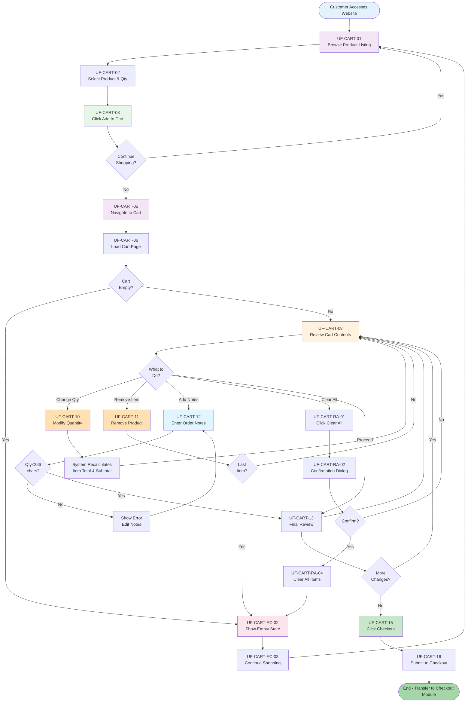

# User Flow Analysis - Shopping Cart Module

---

## 1. User Flow Purpose

Tài liệu User Flow mô tả chi tiết các bước và quyết định mà khách hàng sẽ thực hiện khi sử dụng module Giỏ hàng để chuẩn bị đơn hàng trước bước thanh toán.

**Mục đích:**
- Xác định tất cả các bước trong quy trình (happy path & edge cases)
- Mô tả tương tác giữa Customer và System
- Xác định các decision points và branching logic
- Chuẩn bị foundation cho Use Case Specifications & Test Cases
- Hướng dẫn cho phát triển giao diện (UI/UX)

**Phạm Vi:**
- Từ khi khách hàng thêm sản phẩm vào giỏ hàng
- Đến khi khách hàng nhấn "Proceed to Checkout"
- **KHÔNG bao gồm:** Product browsing, Payment, Shipping, Authentication

---

## 2. Primary Actor

| Actor | Mô Tả | Role |
|-------|--------|------|
| **Customer / End-user** | Người mua hàng trên website | Primary Actor (người khởi động quy trình) |
| **System** | Shopping Cart Module | Secondary Actor (xử lý logic) |
| **Backend API** | Product & Price Data Provider | Supporting (cung cấp data) |

---

## 3. Preconditions

Những điều kiện phải có trước khi User Flow bắt đầu:

| Precondition | Mô Tả | Status |
|-------------|--------|--------|
| **PC-01** | Customer đã truy cập website | ✅ Required |
| **PC-02** | Product Listing & Browsing module có sẵn | ✅ Required |
| **PC-03** | Customer đã chọn ít nhất 1 sản phẩm | ✅ Required |
| **PC-04** | Backend API để lấy product data & pricing | ✅ Required |
| **PC-05** | Website backend có sẵn để lưu/quản lý cart | ✅ Required |
| **PC-06** | Network connectivity ổn định | ✅ Required |
| **PC-07** | Checkout Module sẽ ready khi customer proceed | ✅ Required (assumption) |

---

## 4. Entry Points

Các điểm mà Customer có thể bắt đầu sử dụng Shopping Cart:

| Entry Point | Trigger | Mô Tả |
|------------|---------|--------|
| **EP-01: Add to Cart** | Customer click "Add to Cart" button từ Product Detail page | Primary entry point |
| **EP-02: Quick Add** | Customer click "Quick Add" từ Product Listing (nếu có) | Alternative entry |
| **EP-03: Resume Cart** | Customer return & access saved cart (Phase 2+ feature) | Future entry point |
| **EP-04: Direct Cart Access** | Customer click cart icon / "My Cart" link trong header | Access existing cart |

**Phase 1 Focus:** EP-01 & EP-04 (Primary entry points)

---

## 5. Main User Flow

### 5.1. Main Flow Narrative

**Happy Path: Browse → Select → Add to Cart → Review → Modify → Checkout**

| Step | Step ID | Actor | User Action | System Response | Related Rule | Next Step |
|------|---------|-------|-------------|-----------------|--------------|-----------|
| 1 | **UF-CART-01** | Customer | Browsing product catalog & see product details | System displays: Product image, name, description, price, "Add to Cart" button | - | UF-CART-02 |
| 2 | **UF-CART-02** | Customer | Select product & choose quantity (in Product Detail page) | System accepts quantity input, validates if ≥1 | Must be ≥1, may have max limit (TBD) | UF-CART-03 |
| 3 | **UF-CART-03** | Customer | Click "Add to Cart" button | System adds product to cart, shows confirmation message | SC-03: Add product with qty | UF-CART-04 |
| 4 | **UF-CART-04** | Customer | Customer can: (a) Continue shopping, OR (b) View cart | If (a): Continue browsing → UF-CART-01 again; If (b): Navigate to cart page | - | UF-CART-05 or UF-CART-01 |
| 5 | **UF-CART-05** | Customer | Navigate to Shopping Cart page (via cart icon or "View Cart" link) | System loads & displays cart page with SC-01 | - | UF-CART-06 |
| 6 | **UF-CART-06** | Customer | System displays cart contents to customer | Display: Product list with image, name, unit price, qty, item total, subtotal | SC-01, SC-02, SC-06, SC-07 | UF-CART-07 |
| 7 | **UF-CART-07** | System | System checks if cart is empty | If empty: Go to UF-CART-EC-01 (Empty Cart Flow); If not empty: Continue | SC-14: Empty state | UF-CART-EC-01 or UF-CART-08 |
| 8 | **UF-CART-08** | Customer | Customer reviews cart contents (products, qty, prices, subtotal) | System displays all details real-time | SC-01 ~ SC-07 | UF-CART-09 |
| 9 | **UF-CART-09** | Customer | Customer makes decision: Change quantity? Remove item? Add notes? Or proceed? | Depends on customer decision | - | UF-CART-10 (qty change) / UF-CART-11 (remove item) / UF-CART-12 (add notes) / UF-CART-15 (proceed) |
| 10 | **UF-CART-10** | Customer | Customer modifies quantity (increase or decrease) for a product | System recalculates: Item Total = Unit Price × New Qty; Recalculates Subtotal; Updates display real-time | SC-03 (increase), SC-04 (decrease), SC-05 (min=1), SC-06, SC-07 | UF-CART-09 (loop back to review) |
| 11 | **UF-CART-11** | Customer | Customer click "Remove" button for a product | System removes product from cart, recalculates Subtotal, updates display | SC-11 | UF-CART-09 (loop back) or UF-CART-EC-01 (if last item) |
| 12 | **UF-CART-12** | Customer | Customer click "Add Order Notes" field & enters notes (optional) | System accepts text input, validates character count (≤256 chars) | SC-09, SC-10: Max 256 chars | UF-CART-13 (if notes valid) or UF-CART-ON-02 (if exceeds limit) |
| 13 | **UF-CART-13** | Customer | Customer reviews final cart: products, qty, total, notes (if any) | System displays complete order summary with all details | All SC-01 ~ SC-12 | UF-CART-14 |
| 14 | **UF-CART-14** | Customer | Customer can: (a) Make more changes → UF-CART-09, OR (b) Proceed to checkout | If (a): Review again; If (b): Ready to confirm | - | UF-CART-09 or UF-CART-15 |
| 15 | **UF-CART-15** | Customer | Click "Proceed to Checkout" / "Continue to Payment" button | System validates cart data, prepares to handoff to Checkout module | SC-15 | UF-CART-16 |
| 16 | **UF-CART-16** | System | System submits cart data & navigates to Checkout page (next module) | Checkout module takes over; Shopping Cart flow ends | Out of scope | [End of Shopping Cart Flow] |

### 5.2. Main Flow Diagram Description

```
Start → Browse Products → Select Qty → Add to Cart 
  → Continue? YES → Browse again (loop)
  → Continue? NO → View Cart → Check if Empty
  
If Empty → Show Empty State → Continue Shopping (loop)
If Not Empty → Review Contents → Modify?

  Modify Options:
    → Change Qty → Recalculate → Back to Review
    → Remove Item → Update Cart → Back to Review
    → Add Notes → Validate Limit → Back to Review
    → Proceed Checkout → Submit Cart → End
```

---

## 6. Alternative Flows

### 6.1. Alternative Flow 1: Quantity equals 1 (Cannot Decrease Further)

| Step | Step ID | Actor | User Action | System Response | Related Rule | Condition |
|------|---------|-------|-------------|-----------------|--------------|-----------|
| 1 | **UF-CART-AF1-01** | Customer | Product has Qty=1 in cart | - | - | - |
| 2 | **UF-CART-AF1-02** | Customer | Customer clicks "-" (decrease button) | System disables decrease button (grayed out) OR shows message "Qty cannot be less than 1" | SC-05: Min qty = 1 | Alternative triggered |
| 3 | **UF-CART-AF1-03** | Customer | Customer is informed qty cannot be 0 | System suggests customer use "Remove" button instead | SC-05 | Continue to UF-CART-09 |

**When triggered:** When product quantity reaches 1 and customer tries to decrease

---

### 6.2. Alternative Flow 2: Order Notes Exceed 256 Characters

| Step | Step ID | Actor | User Action | System Response | Related Rule | Condition |
|------|---------|-------|-------------|-----------------|--------------|-----------|
| 1 | **UF-CART-AF2-01** | Customer | Customer enters notes > 256 characters | - | - | - |
| 2 | **UF-CART-AF2-02** | System | System detects character count exceeds 256 | System: (a) Prevents input after 256 chars (client-side), OR (b) Shows error message | SC-10: Max 256 chars | Alternative triggered |
| 3 | **UF-CART-AF2-03** | Customer | Customer sees error/warning | Customer edits notes to ≤256 characters | SC-10 | Go to UF-CART-13 |

**When triggered:** When customer enters long notes

---

### 6.3. Alternative Flow 3: Customer Cancels Remove All Action

| Step | Step ID | Actor | User Action | System Response | Related Rule | Condition |
|------|---------|-------|-------------|-----------------|--------------|-----------|
| 1 | **UF-CART-AF3-01** | Customer | Customer click "Clear All" button to remove all products | System shows confirmation dialog/popup | SC-13: Confirmation popup | - |
| 2 | **UF-CART-AF3-02** | Customer | Customer clicks "Cancel" in confirmation dialog | System closes dialog, cart remains unchanged | SC-13 | Alternative triggered |
| 3 | **UF-CART-AF3-03** | Customer | Customer is back to cart review | Cart still has all products | - | Go to UF-CART-09 |

**When triggered:** Customer changes mind about clearing cart

---

### 6.4. Alternative Flow 4: Remove Last Item in Cart

| Step | Step ID | Actor | User Action | System Response | Related Rule | Condition |
|------|---------|-------|-------------|-----------------|--------------|-----------|
| 1 | **UF-CART-AF4-01** | Customer | Cart has only 1 product; customer clicks "Remove" | System removes the product | SC-11 | - |
| 2 | **UF-CART-AF4-02** | System | Cart becomes empty | System transitions to Empty Cart state | SC-14 | Alternative triggered |
| 3 | **UF-CART-AF4-03** | Customer | System displays "Your cart is empty" message with "Continue Shopping" button | Customer can return to browsing | SC-14 | Go to UF-CART-EC-02 |

**When triggered:** When removing the last product from cart

---

### 6.5. Alternative Flow 5: Customer Returns to Browse While in Cart

| Step | Step ID | Actor | User Action | System Response | Related Rule | Condition |
|------|---------|-------|-------------|-----------------|--------------|-----------|
| 1 | **UF-CART-AF5-01** | Customer | While reviewing cart, customer click "Continue Shopping" button | System navigates back to Product Listing page | - | - |
| 2 | **UF-CART-AF5-02** | Customer | Customer can continue browsing & adding products | Cart is maintained (Phase 1 assumes server-side or session-based cart) | - | Alternative triggered |
| 3 | **UF-CART-AF5-03** | Customer | Customer can return to cart anytime via cart icon | Cart data is preserved | - | Go to UF-CART-05 |

**When triggered:** Customer wants to add more products before checkout

---

## 7. Exception Flows

### 7.1. Exception Flow 1: Invalid Quantity Input

| Step | Step ID | Actor | User Action | System Response | Related Rule | Condition |
|------|---------|-------|-------------|-----------------|--------------|-----------|
| 1 | **UF-CART-EX1-01** | Customer | Customer manually enters non-numeric or negative qty (e.g., "-5", "abc") | - | - | - |
| 2 | **UF-CART-EX1-02** | System | System detects invalid input | System: Rejects input, shows error message "Please enter valid quantity (1 or more)" | SC-05 | Exception triggered |
| 3 | **UF-CART-EX1-03** | Customer | Customer sees error & corrects input | Customer re-enters valid quantity | - | Go to UF-CART-10 |

**When triggered:** Invalid input for quantity field

---

### 7.2. Exception Flow 2: Network Error During Cart Update

| Step | Step ID | Actor | User Action | System Response | Related Rule | Condition |
|------|---------|-------|-------------|-----------------|--------------|-----------|
| 1 | **UF-CART-EX2-01** | Customer | Customer modifies qty or removes item | Network connection interrupted | - | - |
| 2 | **UF-CART-EX2-02** | System | System fails to sync with backend | System: Shows error message "Unable to update cart. Please try again." | - | Exception triggered |
| 3 | **UF-CART-EX2-03** | Customer | Customer sees error notification | Customer can retry action or refresh page | - | Go to UF-CART-09 (retry) or UF-CART-05 (refresh) |

**When triggered:** Network connectivity issues

---

### 7.3. Exception Flow 3: Product Out of Stock After Adding to Cart

| Step | Step ID | Actor | User Action | System Response | Related Rule | Condition |
|------|---------|-------|-------------|-----------------|--------------|-----------|
| 1 | **UF-CART-EX3-01** | Customer | Customer added product to cart; product goes out of stock (another order took it) | - | - | - |
| 2 | **UF-CART-EX3-02** | System | System detects stock unavailable when reviewing or checking out | System: Shows warning "This product is no longer available. Please remove it or check availability." | Out of Scope (Inventory) | Exception triggered |
| 3 | **UF-CART-EX3-03** | Customer | Customer notified of stock issue | Customer must remove product or wait for restock | - | Go to UF-CART-09 or UF-CART-RM-01 |

**When triggered:** Product inventory issue (Proposed Future: Inventory Integration)

---

## 8. Empty Cart Flow

### 8.1. Empty Cart Handling

**Trigger:** When cart is empty (no products)

| Step | Step ID | Actor | User Action | System Response | Related Rule | Condition |
|------|---------|-------|-------------|-----------------|--------------|-----------|
| 1 | **UF-CART-EC-01** | System | Check if cart has products | If cart is empty → Go to UF-CART-EC-02 | SC-14 | Condition: cart is empty |
| 2 | **UF-CART-EC-02** | System | Display Empty State page | Show: "Your cart is empty" message + "Continue Shopping" button + Optional: Recommended products | SC-14 | - |
| 3 | **UF-CART-EC-03** | Customer | Customer clicks "Continue Shopping" | System navigates back to Product Listing | - | Go to UF-CART-01 |
| 4 | **UF-CART-EC-04** | Customer | Customer can add products again | Flow returns to UF-CART-03 (after adding product) | - | Go back to Main Flow |

**Special Handling:**
- Display friendly message when cart is empty
- Suggest customer to continue shopping
- Optional: Show recommended/popular products to encourage browsing

---

## 9. Order Note Validation Flow

### 9.1. Order Note Validation

**Trigger:** When customer enters or edits order notes

| Step | Step ID | Actor | User Action | System Response | Related Rule | Condition |
|------|---------|-------|-------------|-----------------|--------------|-----------|
| 1 | **UF-CART-ON-01** | Customer | Customer click "Add Order Notes" field & starts typing | System accepts text input, displays character counter (e.g., "45/256") | SC-09: Input field | - |
| 2 | **UF-CART-ON-02** | System | System monitors character count as customer types | If count ≤ 256: Allow input; If count > 256: Either reject additional chars (client-side) OR show error | SC-10: Max 256 chars | Alternative: UF-CART-AF2 |
| 3 | **UF-CART-ON-03** | Customer | Customer finishes entering notes (≤256 chars) | System saves notes in order object | SC-09, SC-10 | - |
| 4 | **UF-CART-ON-04** | Customer | Customer sees notes saved with confirmation | Notes displayed in order summary | - | Go to UF-CART-13 |

**Special Rules:**
- Max 256 characters enforced
- Character counter shown for UX
- Notes are optional (not required)
- No special formatting allowed (plain text)

---

## 10. Remove Item Flow

### 10.1. Remove Single Item

**Trigger:** When customer clicks remove button for a product

| Step | Step ID | Actor | User Action | System Response | Related Rule | Condition |
|------|---------|-------|-------------|-----------------|--------------|-----------|
| 1 | **UF-CART-RM-01** | Customer | Customer click "Remove" button for a specific product in cart | System shows item highlighted/selected | SC-11 | - |
| 2 | **UF-CART-RM-02** | System | System processes removal request | System removes product from cart | SC-11 | - |
| 3 | **UF-CART-RM-03** | System | System recalculates totals | System: Recalculates Item Totals, Subtotal; Updates display real-time | SC-06, SC-07 | - |
| 4 | **UF-CART-RM-04** | System | Check if cart is now empty | If empty → Go to UF-CART-EC-01; If not empty → Continue | SC-14 | Condition: Last item removed? |
| 5 | **UF-CART-RM-05** | Customer | Customer sees updated cart without the removed product | Cart display refreshed | - | Go to UF-CART-09 or UF-CART-EC-02 |

**Special Handling:**
- No confirmation needed for single item removal (quick action)
- If last item: Transition to Empty Cart Flow
- Real-time total recalculation

---

## 11. Remove All Flow

### 11.1. Remove All Items with Confirmation

**Trigger:** When customer clicks "Clear All" or "Remove All" button

| Step | Step ID | Actor | User Action | System Response | Related Rule | Condition |
|------|---------|-------|-------------|-----------------|--------------|-----------|
| 1 | **UF-CART-RA-01** | Customer | Customer click "Clear All" button | System displays confirmation dialog/popup | SC-13: Confirmation | - |
| 2 | **UF-CART-RA-02** | System | Confirmation dialog shows: "Are you sure you want to clear your cart?" with "Confirm" & "Cancel" buttons | Dialog displayed | SC-13 | - |
| 3 | **UF-CART-RA-03** | Customer | Customer clicks "Confirm" (or "Cancel" → Go to UF-CART-AF3-02) | System processes removal | SC-13 | Condition: Customer confirms? |
| 4 | **UF-CART-RA-04** | System | System removes ALL products from cart | Cart becomes empty | SC-12 | - |
| 5 | **UF-CART-RA-05** | System | System transitions to Empty Cart state | Display empty cart message | SC-14 | - |
| 6 | **UF-CART-RA-06** | Customer | Customer sees "Your cart is empty" with "Continue Shopping" button | Customer can return to browsing | SC-14 | Go to UF-CART-EC-02 |

**Special Rules:**
- Confirmation popup is REQUIRED for "Clear All" (SC-13)
- Prevents accidental cart clearing
- Clear confirmation text for user understanding

---

## 12. Exit Points

Các điểm mà Customer có thể rời khỏi Shopping Cart flow:

| Exit Point | Trigger | Mô Tả | Destination |
|-----------|---------|--------|-------------|
| **EXIT-01: Proceed to Checkout** | Customer click "Proceed to Checkout" / "Continue to Payment" button | Normal completion of Shopping Cart flow | Checkout Module (Phase 1 Out of Scope) |
| **EXIT-02: Continue Shopping** | Customer click "Continue Shopping" from cart or empty state | Return to product browsing | Product Listing Module |
| **EXIT-03: Close Browser / Navigate Away** | Customer closes tab or navigates away | Session end | Session management (depends on cart persistence) |
| **EXIT-04: Timeout** | Session timeout or inactivity | User session ends | Login page or home page (Phase 1 assumes no timeout) |
| **EXIT-05: Abandon Cart** | Customer leaves without checkout | Incomplete transaction | Out of scope (may be tracked in Phase 2+ analytics) |

**Phase 1 Focus:** EXIT-01 (Normal), EXIT-02 (Alt), EXIT-03/04 (System handling)

---

## 13. Mermaid User Flow Diagram



---

## 14. Flow Validation Notes

### 14.1. Design Decisions

| Decision | Rationale | Impact |
|----------|-----------|--------|
| **No Confirmation for Single Item Remove** | Quick actions improve UX; single removal is low-risk | UX efficiency |
| **Confirmation Required for Clear All** | Prevents accidental cart clearing; high-risk operation | Data protection |
| **Real-time Total Recalculation** | Provides immediate feedback; improves confidence | Performance consideration |
| **Optional Order Notes** | Supports special requests without forcing input | Flexibility |
| **256 Character Limit** | Balance between capturing notes & UI constraints | Business rule |
| **Empty State as Distinct Flow** | Clear messaging when cart is empty | User guidance |

### 14.2. Integration Points

| Integration Point | Module | Dependency | Phase |
|------------------|--------|-----------|-------|
| **Product Browsing** | Product Listing Module | Required for UF-CART-01 | Phase 1 |
| **Add to Cart** | Product Detail Module | Required for UF-CART-03 | Phase 1 |
| **Cart Display** | Shopping Cart Module | Core functionality | Phase 1 |
| **Checkout Handoff** | Checkout Module | Required for UF-CART-16 | Phase 2+ |
| **Order Processing** | Order Management Module | Backend processing | Phase 2+ |
| **Inventory Check** | Inventory Module | Optional for Phase 1 (Proposed) | Phase 2+ |

### 14.3. Assumptions

| Assumption | Status | Notes |
|-----------|--------|-------|
| **Cart Persistence** | ⚠️ Assumed | Cart data maintained during session (server-side or session-based); long-term persistence is Phase 2+ |
| **Product Data Available** | ✅ Confirmed | Backend API provides product & pricing data |
| **Checkout Module Ready** | ⚠️ Assumed | Checkout module will be ready when customer proceeds; integration occurs in Phase 2+ |
| **No Real-time Inventory** | ⚠️ Assumed | Phase 1 assumes inventory check at checkout, not in cart (can be proposed improvement) |
| **No Promos/Discounts** | ✅ Confirmed | Phase 1 scope excludes promo codes; Phase 2+ feature |
| **No Authentication** | ✅ Confirmed | Phase 1 scope excludes login/authentication; assumed already logged in |

### 14.4. Edge Cases Handled

| Edge Case | Handling | Flow |
|-----------|----------|------|
| **Empty Cart** | Show empty state, suggest continue shopping | UF-CART-EC |
| **Qty = 1 (Cannot decrease)** | Disable decrease button; suggest remove instead | UF-CART-AF1 |
| **Long Notes (>256 chars)** | Reject input or show error; prompt to edit | UF-CART-AF2 |
| **Cancel Clear All** | Confirmation dialog; cart preserved | UF-CART-AF3 |
| **Remove Last Item** | Transition to empty state | UF-CART-AF4 |
| **Return to Browse** | Cart preserved; can resume later | UF-CART-AF5 |
| **Network Error** | Show error; allow retry | UF-CART-EX2 |
| **Invalid Input** | Validation error; prompt to correct | UF-CART-EX1 |

### 14.5. Implementation Notes

| Note | Details |
|------|---------|
| **Real-time Calculations** | All price recalculations should be instant to provide immediate feedback |
| **Confirmation Dialogs** | Clear, non-technical language for confirmation messages |
| **Error Messages** | Helpful, specific error messages to guide user actions |
| **Character Counter** | Display character count for notes field (e.g., "45/256") for transparency |
| **Button States** | Disable buttons when not applicable (e.g., decrease qty when qty=1) |
| **Loading States** | Show loading indicators during network operations |
| **Accessibility** | Ensure all flows work with keyboard navigation & screen readers |

---

## 15. Related Requirements Mapping

### 15.1. Shopping Cart Functions Covered by User Flow

| Shopping Cart Function | Related Flow Steps | Use Case |
|----------------------|-------------------|----------|
| **SC-01: View Cart Items** | UF-CART-05, UF-CART-06, UF-CART-08 | Display products when viewing cart |
| **SC-02: Display Product Info** | UF-CART-06, UF-CART-08 | Show product details in cart list |
| **SC-03: Increase Qty** | UF-CART-10 | Customer increases quantity |
| **SC-04: Decrease Qty** | UF-CART-10, UF-CART-AF1 | Customer decreases quantity |
| **SC-05: Min Qty Check** | UF-CART-AF1 | Prevent qty < 1 |
| **SC-06: Item Total** | UF-CART-10, UF-CART-RM-03 | Auto calculate item total |
| **SC-07: Subtotal** | UF-CART-10, UF-CART-RM-03 | Auto calculate subtotal |
| **SC-09: Order Notes** | UF-CART-12, UF-CART-ON | Customer enters notes |
| **SC-10: Note Validation** | UF-CART-AF2, UF-CART-ON-02 | Validate 256 char limit |
| **SC-11: Remove Item** | UF-CART-11, UF-CART-RM | Customer removes single product |
| **SC-12: Clear All** | UF-CART-RA | Customer removes all products |
| **SC-13: Confirmation** | UF-CART-RA-02, UF-CART-AF3 | Show confirmation dialog |
| **SC-14: Empty State** | UF-CART-EC | Display when cart empty |
| **SC-15: Checkout** | UF-CART-15, UF-CART-16 | Proceed to checkout |

### 15.2. Business Rules Covered

| Business Rule | User Flow Coverage | Enforcement |
|---------------|-------------------|------------|
| **BR-CART-01: Min Qty = 1** | UF-CART-AF1, UF-CART-10 | Client-side validation |
| **BR-CART-02: Max Notes = 256 chars** | UF-CART-AF2, UF-CART-ON-02 | Client & server validation |
| **BR-CART-03: Prices Auto Recalculate** | UF-CART-10, UF-CART-RM-03 | Real-time system calculation |
| **BR-CART-04: Clear All Requires Confirm** | UF-CART-RA-02, UF-CART-AF3 | UI confirmation dialog |
| **BR-CART-05: Cart Empty → Empty State** | UF-CART-EC-02, UF-CART-AF4 | State-based UI rendering |

---

## 16. Summary

### 16.1. Flow Overview

| Aspect | Detail |
|--------|--------|
| **Primary Actor** | Customer (end-user) |
| **Entry Points** | 2 main (Add to Cart, View Cart) |
| **Main Flow Steps** | 16 steps (UF-CART-01 ~ UF-CART-16) |
| **Alternative Flows** | 5 scenarios covered |
| **Exception Flows** | 3 error cases handled |
| **Exit Points** | 5 possible exits |
| **Special Flows** | Empty Cart, Note Validation, Remove Item, Remove All |
| **Total Steps Documented** | 50+ detailed steps |

### 16.2. Key Features Demonstrated

- ✅ Browse and select products
- ✅ Add products to cart
- ✅ View and review cart
- ✅ Modify quantities (increase/decrease)
- ✅ Remove items (single or all)
- ✅ Add optional order notes
- ✅ Real-time calculations
- ✅ Empty cart handling
- ✅ Confirmation dialogs
- ✅ Error handling
- ✅ Proceed to checkout

### 16.3. Deliverables

- ✅ User Flow narrative (main + alternatives + exceptions)
- ✅ Detailed step tables with all metadata
- ✅ Mermaid flowchart diagram
- ✅ Edge case handling
- ✅ Integration points documented
- ✅ Business rules mapping
- ✅ Implementation notes

---

## 17. References

- **docs/01-project-overview.md**: Project structure & context
- **docs/02-business-context.md**: Business needs & user needs
- **docs/03-stakeholders.md**: Stakeholder roles & needs
- **docs/04-project-scope.md**: Shopping Cart functions (SC-01 ~ SC-15)
- **docs/05-as-is-to-be.md**: Process improvements & TO-BE design

---

**Document Status:**
- ✅ User Flow Complete
- ✅ All 15 Shopping Cart Functions Covered
- ✅ Alternative Flows Detailed
- ✅ Exception Flows Handled
- ⏳ Ready for Use Case & Test Case Derivation

**Next Steps:**
- docs/07-user-stories.md (User Stories & Acceptance Criteria)
- docs/08-use-case.md (Detailed Use Case Specifications)
- docs/09-test-cases.md (Functional Test Cases)

---

**Disclaimer:**
- This user flow is based on Phase 1 analysis & design
- Actual implementation may vary based on technical constraints
- Integration with other modules (Checkout, Payment, Inventory) assumed for Phase 2+
- User flow has not been tested with actual users; usability testing recommended in Phase 2+
